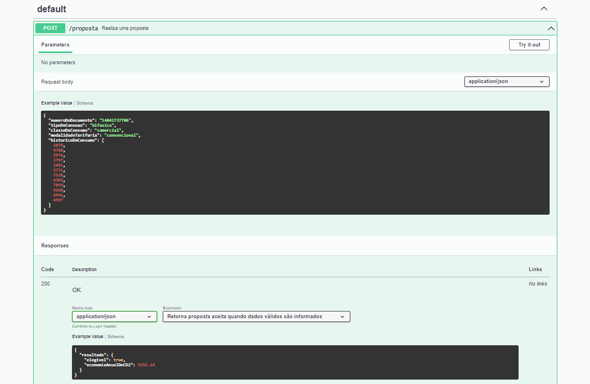
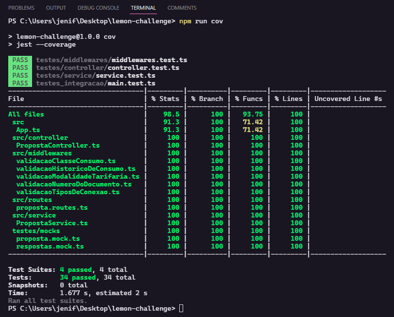

# Projeto API consulta de elegibilidade de Clientes Lemon 
## Historia do Usuario:
> Nem todos os clientes que desejam fazer parte da Lemon podem ser aceitos no momento. Seja por razões regulatórias ou porque não vale a pena para o cliente ou para a Lemon ter essa empresa como cliente. No processo de aquisição de clientes, fazemos a checagem de elegibilidade da mesma, através dos dados contidos na conta de luz do cliente. Caso a empresa não seja elegível, precisamos explicitar os motivos para tal. Caso ela seja elegível, precisamos calcular também a projeção da quantidade de CO2 que ela deixaria de emitir caso usasse energia limpa.
  
## Sobre o projeto:
O projeto em si é uma API desenvolvida em Node.JS com Typescript e express para consultar a elegibilidade de clientes com base na regra de negocio.
> Você pode ver mais inforamções sobre a regra de negocio em: [Lemon](https://lemonenergy.notion.site/Teste-Backend-Lemon-Elegibilidade-9958a9678c0d4ac99185850fdb9716fc)
## Depedencias
| Dependencia| Versao   |
|------------|--------- |
| Node       | 16.13.1  |
| npm        |  8.1.2   |
| Express    | ^4.18.2  |
| Typescript | ^4.9.4   |
| Jest       | ^29.3.1  |
| Swagger    | ^4.6.0   |
| Supertest  | ^6.3.3   |

## Como rodar o projeto:
1. Clonar este repositorio:
```
git clone https://github.com/jenifergs/desafio-elegibilidade-lemon
```
2. Entrar na pasta principal:
```
cd desafio-elegibilidade-lemon
```
3. Instalar dependencias
```
npm i
```
4. Executar o comando para subir em produção:
```
npm run prod
```
5. (Opcional) Verificar a documentação (SWAGGER) das rotas:
Uma vez online, o servidor deve expor na roda /api-docs o
site contendo o [swagger](http://localhost:5433/api-docs/)
O conteudo deverá ser parecido com:

6. (Opcional) Importar requisições automaticamente:

 [](https://insomnia.rest/run/?label=Desafio-elegibilidade-lemon&uri=https%3A%2F%2Fraw.githubusercontent.com%2Fjenifergs%2Fdesafio-elegibilidade-lemon%2Fmaster%2Fassets%2FInsomnia_desafio-elegibilidade-lemon)

 7. Executar os testes:
 ```
 npm test
 ```
 8. (Opcional) Obter Cobertura de Testes
 ```
 npm run cov
 ```
 O resultado deverá ser parecido com:
 
## Instruções gerais
- O codigo fonte encontra-se dentro da pasta src
- O testes unitarios encontram-se dentro da pastas testes
- O testes de integração encontram-se na pasta testes_integracao

---

### Feito com 💚 Por [Jenifer Gonçalves](https://jenifergs.github.io/my-social-links/) Para [Lemon Energia](https://www.energialemon.com.br/) 🍋
